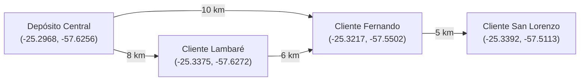
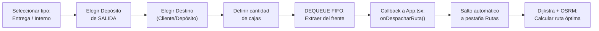
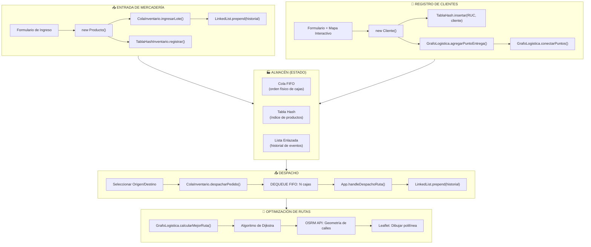

#  Reporte Completo del Sistema LogiStock

> **Sistema de Gestión de Inventario y Logística para PYMEs Paraguayas**
> Fecha de análisis: 7 de junio de 2026

---

## 1. Resumen Ejecutivo

**LogiStock** es una plataforma web Single-Page Application (SPA) diseñada para pequeños emprendedores y microempresas en Paraguay. Su propósito es centralizar y profesionalizar tres operaciones críticas de cualquier negocio con productos físicos:

1. **Gestión de inventario** con política FIFO (First In, First Out)
2. **Optimización de rutas de entrega** mediante el algoritmo de Dijkstra
3. **Directorio de clientes** con búsqueda instantánea O(1) por Tabla Hash

El sistema implementa **4 estructuras de datos avanzadas** construidas desde cero (sin usar `Map`, `Set`, ni objetos literales como diccionario primitivo), lo que le da un fuerte enfoque académico además del valor práctico.

---

## 2. Stack Tecnológico

| Capa | Tecnología | Versión |
|------|-----------|---------|
| **Framework UI** | React | 19.0.1 |
| **Lenguaje** | TypeScript | ~5.8.2 |
| **Bundler** | Vite | ^6.2.3 |
| **Estilos** | TailwindCSS | ^4.1.14 |
| **Mapas** | Leaflet + React-Leaflet | 1.9.4 / 5.0.0 |
| **Iconos** | Lucide React + Material Symbols | ^0.546.0 |
| **Animaciones** | Motion (Framer Motion) | ^12.23.24 |
| **Routing de calles** | OSRM (API externa) | Pública |
| **IA (configurada)** | Google GenAI SDK | ^1.29.0 |
| **Tipografía** | Inter (Google Fonts) | — |

### Scripts disponibles

```bash
npm run dev      # Servidor de desarrollo en puerto 3000
npm run build    # Compilación de producción
npm run preview  # Preview del build de producción
npm run lint     # Verificación de tipos TypeScript
npm run clean    # Limpieza del directorio dist
```

---

## 3. Arquitectura del Proyecto

```
LogiStock/
├── index.html                    # Entry point HTML
├── vite.config.ts                # Configuración de Vite + TailwindCSS
├── package.json                  # Dependencias y scripts
├── tsconfig.json                 # Configuración TypeScript
└── src/
    ├── main.tsx                  # Bootstrap de React
    ├── App.tsx                   # Componente raíz (780 líneas)
    ├── index.css                 # Sistema de diseño (Design Tokens)
    ├── assets/                   # Logo y recursos estáticos
    ├── models/                   # Modelos de dominio (POO)
    │   ├── index.tsx             # Barrel exports
    │   ├── Producto.tsx          # Clase Producto
    │   ├── Cliente.tsx           # Clase Cliente
    │   ├── EstadoPedido.tsx      # Clase Pedido + tipos de estado
    │   ├── LineaPedido.tsx       # Clase LineaPedido
    │   └── NodoEntrega.tsx       # Clase NodoEntrega
    ├── lib/
    │   └── dataStructures/       # Estructuras de datos personalizadas
    │       ├── tablaHash.ts      # Tabla Hash genérica (Chaining)
    │       ├── tablaHashInventario.ts  # Especialización para productos
    │       ├── colaInventario.ts # Cola genérica + Cola de inventario FIFO
    │       ├── grafo.ts          # Grafo base con Dijkstra
    │       ├── grafoLogistica.ts # Grafo logístico especializado
    │       └── listaEnlazada.ts  # Lista Enlazada para historial
    ├── pages/                    # Vistas/Pantallas
    │   ├── Inventario.tsx        # Gestión de inventario (492 líneas)
    │   └── Rutas.tsx             # Planificador de rutas (250 líneas)
    └── utils/
        └── generadorIds.ts       # Singleton generador de IDs secuenciales
```

---

## 4. Estructuras de Datos Implementadas

### 4.1 Tabla Hash — `TablaHash<T>` y `TablaHashInventario`

| Aspecto | Detalle |
|---------|---------|
| **Archivo** | [tablaHash.ts](file:///d:/Mis%20Documentos/UNIVERSIDAD/Sistema%20de%20Logistica/LogiStock/src/lib/dataStructures/tablaHash.ts) |
| **Tipo** | Genérica `TablaHash<T>` |
| **Política de colisiones** | **Chaining** (Arreglo de Arreglos / Buckets) |
| **Capacidad inicial** | 53 buckets (número primo para reducir colisiones) |
| **Función hash** | Ponderación ASCII con primo impar (31), limitada a 100 caracteres |

#### Operaciones implementadas

| Operación | Complejidad | Método |
|-----------|------------|--------|
| Insertar / Actualizar | O(1) promedio | `insertar(key, value)` |
| Buscar por clave | O(1) promedio | `buscar(key)` |
| Eliminar por clave | O(1) promedio | `eliminar(key)` |
| Listar todas las claves | O(n) | `obtenerClaves()` |
| Listar todos los valores | O(n) | `obtenerValores()` |

#### Uso en el sistema

- **`TablaHash<Cliente>`**: Almacena clientes indexados por su RUC/Cédula. Permite búsquedas O(1) en la pantalla de Clientes.
- **`TablaHashInventario`**: Especialización que indexa productos por su código único (`P-001`, `P-002`, etc.) y complementa la cola FIFO para localizar productos sin recorrer la cola completa.

> [!IMPORTANT]
> La implementación **no utiliza** `Map`, `Set` ni objetos literales como diccionario. Construye manualmente el arreglo de buckets y resuelve colisiones con chaining.

---

### 4.2 Cola FIFO — `Cola<T>` y `ColaInventario`

| Aspecto | Detalle |
|---------|---------|
| **Archivo** | [colaInventario.ts](file:///d:/Mis%20Documentos/UNIVERSIDAD/Sistema%20de%20Logistica/LogiStock/src/lib/dataStructures/colaInventario.ts) |
| **Política** | **FIFO** (First In, First Out) |
| **Estructura interna** | Arreglo privado (`private items: T[]`) |

#### Cola Genérica (`Cola<T>`)

| Operación | Complejidad | Método |
|-----------|------------|--------|
| Encolar (agregar al final) | O(1) amortizado | `encolar(elemento)` |
| Desencolar (extraer del frente) | O(n)* | `desencolar()` |
| Ver frente (sin remover) | O(1) | `verFrente()` |
| Verificar si está vacía | O(1) | `estaVacia()` |
| Obtener tamaño | O(1) | `tamanio()` |

> *`shift()` de JS es O(n) por reindexación del arreglo.

#### Cola de Inventario (`ColaInventario`)

Especialización que aplica FIFO estrictamente para la gestión de productos:

| Operación | Descripción |
|-----------|-------------|
| `ingresarLote(producto, cantidad)` | Encola N copias del producto (simula recepción física de cajas) |
| `despacharPedido(cantidadRequerida)` | Desencola N unidades del frente (los más antiguos salen primero) |
| `mapearStockActual()` | Copia superficial para renderizar en React sin romper encapsulamiento |

#### Uso en el sistema

- Cada "caja" en bodega es un elemento individual en la cola
- Al despachar, las cajas más antiguas salen primero (regla FIFO)
- La visualización muestra el array con indicadores de `FRENTE` (salida) y `FONDO` (entrada)

---

### 4.3 Grafo con Dijkstra — `GrafoRutas` y `GrafoLogistica`

| Aspecto | Detalle |
|---------|---------|
| **Archivos** | [grafo.ts](file:///d:/Mis%20Documentos/UNIVERSIDAD/Sistema%20de%20Logistica/LogiStock/src/lib/dataStructures/grafo.ts) y [grafoLogistica.ts](file:///d:/Mis%20Documentos/UNIVERSIDAD/Sistema%20de%20Logistica/LogiStock/src/lib/dataStructures/grafoLogistica.ts) |
| **Tipo** | **No dirigido y ponderado** |
| **Representación** | **Lista de Adyacencia** |
| **Algoritmo de optimización** | **Dijkstra** (ruta más corta punto a punto) |

#### Grafo Base (`GrafoRutas`)

| Operación | Complejidad | Método |
|-----------|------------|--------|
| Agregar vértice | O(1) | `agregarVertice(nodo)` |
| Agregar arista bidireccional | O(1) | `agregarArista(n1, n2, peso)` |
| Obtener conexiones | O(1) | `obtenerConexiones(nodo)` |
| Dijkstra (ruta más corta) | O(V²) | `encontrarRutaMasCorta(inicio, destino)` |

#### Grafo Logístico (`GrafoLogistica`)

Especialización con contexto de negocio logístico:

| Concepto del Grafo | Equivalencia en Logística |
|--------------------|--------------------------|
| **Vértice (Nodo)** | Punto de entrega (depósito o sucursal de cliente) |
| **Arista (Conexión)** | Tramo transitable entre dos puntos |
| **Peso** | Distancia en kilómetros |

| Operación | Método |
|-----------|--------|
| Registrar punto de entrega | `agregarPuntoEntrega(id, nombre, coordenadas)` |
| Definir camino bidireccional | `conectarPuntos(origen, destino, distanciaKm)` |
| Calcular ruta óptima (Dijkstra) | `calcularMejorRuta(idDeposito, idCliente)` |
| Obtener todos los puntos | `getPuntosDeEntrega()` |

> [!NOTE]
> El sistema distingue explícitamente entre **Dijkstra** (ruta más corta A→B) y el **Problema del Viajante de Comercio (TSP)**. El camión traza la ruta más corta entre origen y destino, pero **no** está obligado a hacer paradas logísticas en nodos intermedios.

#### Datos iniciales del grafo



---

### 4.4 Lista Enlazada — `LinkedList<T>`

| Aspecto | Detalle |
|---------|---------|
| **Archivo** | [listaEnlazada.ts](file:///d:/Mis%20Documentos/UNIVERSIDAD/Sistema%20de%20Logistica/LogiStock/src/lib/dataStructures/listaEnlazada.ts) |
| **Responsable** | Nilda Romira Pereira Florentin |
| **Tipo** | Lista enlazada simple (singly linked) |

#### Operaciones

| Operación | Complejidad | Método |
|-----------|------------|--------|
| Insertar al inicio | O(1) | `prepend(value)` |
| Insertar al final | O(n) | `append(value)` |
| Convertir a array | O(n) | `toArray()` |

#### Uso en el sistema

Se utiliza como **registro de historial de actividad** del sistema. Cada nodo almacena:

```typescript
{
  operacion: string;   // 'Entrada Stock', 'Salida Stock', 'Nuevo Cliente'
  producto: string;    // Descripción del evento
  cantidad: number;    // Unidades involucradas
  costo: number;       // Valor monetario en Guaraníes
  estado: string;      // 'COMPLETADO', 'EN CAMINO'
  hora: string;        // Hora del evento
}
```

Los eventos más recientes se insertan al inicio (`prepend`), manteniéndolos visibles primero en la tabla del Dashboard.

---

## 5. Modelos de Dominio

### 5.1 Producto ([Producto.tsx](file:///d:/Mis%20Documentos/UNIVERSIDAD/Sistema%20de%20Logistica/LogiStock/src/models/Producto.tsx))

| Atributo | Tipo | Descripción |
|----------|------|-------------|
| `codigo` | `string` | ID autogenerado (`P-001`, `P-002`...) |
| `nombre` | `string` | Nombre comercial del producto |
| `categoria` | `CategoriaProducto` | `"electronica"` \| `"alimentos"` \| `"ropa"` \| `"hogar"` \| `"otros"` |
| `precio` | `number` | Precio en guaraníes |
| `stockActual` | `number` | Unidades disponibles |
| `stockMinimo` | `number` | Umbral de alerta (default: 5) |
| `fechaIngreso` | `Date` | Fecha de registro |

**Métodos**: `actualizarPrecio()`, `agregarStock()`, `reducirStock()`, `necesitaReabastecimiento()`, `hayStock()`

---

### 5.2 Cliente ([Cliente.tsx](file:///d:/Mis%20Documentos/UNIVERSIDAD/Sistema%20de%20Logistica/LogiStock/src/models/Cliente.tsx))

| Atributo | Tipo | Descripción |
|----------|------|-------------|
| `id` | `string` | ID autogenerado (`C-001`, `C-002`...) |
| `nombre` | `string` | Nombre o razón social |
| `documento` | `string` | RUC o Cédula (validación paraguaya) |
| `email` | `string` | Correo electrónico (validado) |
| `telefono` | `string` | Teléfono (validado) |
| `direccion` | `string` | Dirección principal |
| `modalidadNegocio` | `"MicroEmpresa"` \| `"Emprendedor"` | Clasificación de negocio |
| `cantidadEmpleados` | `string` | Rango de empleados |
| `depositos` | `Deposito[]` | Múltiples sucursales con coordenadas GPS |
| `estado` | `EstadoCliente` | `"activo"` \| `"inactivo"` |

**Validaciones del constructor**:
- Nombre no vacío
- RUC/CI en formato paraguayo (`/^\d+(-\d)?$/`)
- Email con formato válido
- Teléfono con formato válido (6-15 dígitos)
- Dirección obligatoria

**Interface Depósito**:
```typescript
interface Deposito {
  idNodo: string;
  nombre: string;
  direccion: string;
  ciudad: string;
  barrio: string;
  coordenadas: { lat: number; lng: number };
}
```

---

### 5.3 Pedido ([EstadoPedido.tsx](file:///d:/Mis%20Documentos/UNIVERSIDAD/Sistema%20de%20Logistica/LogiStock/src/models/EstadoPedido.tsx))

| Atributo | Tipo | Descripción |
|----------|------|-------------|
| `id` | `string` | Identificador del pedido |
| `cliente` | `Cliente` | Cliente asociado |
| `lineas` | `LineaPedido[]` | Ítems del pedido |
| `estado` | `EstadoPedido` | `"pendiente"` → `"en_ruta"` → `"entregado"` \| `"cancelado"` |
| `fechaCreacion` | `Date` | Cuándo se creó |
| `fechaEntrega` | `Date \| null` | Cuándo se entregó |

**Máquina de estados**: `pendiente` → `en_ruta` → `entregado` (o `cancelado` desde `pendiente`/`en_ruta`)

---

### 5.4 LineaPedido ([LineaPedido.tsx](file:///d:/Mis%20Documentos/UNIVERSIDAD/Sistema%20de%20Logistica/LogiStock/src/models/LineaPedido.tsx))

Representa un ítem dentro de un pedido. Captura el precio al momento de crear el pedido (`precioUnitario = producto.getPrecio()`).

---

### 5.5 NodoEntrega ([NodoEntrega.tsx](file:///d:/Mis%20Documentos/UNIVERSIDAD/Sistema%20de%20Logistica/LogiStock/src/models/NodoEntrega.tsx))

Representa un punto físico de entrega con coordenadas geográficas y estado de entrega (`pendiente` / `entregado`).

---

## 6. Pantallas del Sistema

### 6.1 Dashboard (Panel Principal)

Renderizado directamente en [App.tsx](file:///d:/Mis%20Documentos/UNIVERSIDAD/Sistema%20de%20Logistica/LogiStock/src/App.tsx) como `renderDashboard()`.

| Sección | Descripción | Estructura de datos |
|---------|-------------|---------------------|
| **KPI: Cajas en Bodega** | Total de elementos en la cola FIFO | `ColaInventario.mapearStockActual().length` |
| **KPI: Cajas en Tránsito** | Productos despachados aún no entregados | Estado React `pedidosEnTransito` |
| **KPI: Nodos del Grafo** | Puntos de entrega registrados | `GrafoLogistica.getPuntosDeEntrega()` |
| **KPI: Clientes Hash** | Total de clientes en la tabla hash | `TablaHash.obtenerClaves().length` |
| **Despachos Activos** | Ruta en tránsito con distancia Dijkstra | `GrafoLogistica.calcularMejorRuta()` |
| **Actividad Reciente** | Tabla de historial de operaciones | `LinkedList.toArray()` |

---

### 6.2 Gestión de Inventario

Archivo: [Inventario.tsx](file:///d:/Mis%20Documentos/UNIVERSIDAD/Sistema%20de%20Logistica/LogiStock/src/pages/Inventario.tsx) (492 líneas)

#### Funcionalidades principales

| Función | Operación FIFO | Descripción |
|---------|----------------|-------------|
| **Entrada de Stock** | `ENQUEUE` | Formulario para registrar ingreso de mercadería. Cada unidad se encola individualmente |
| **Preparar Traslado** | `DEQUEUE` | Extrae N cajas del frente de la cola y las conecta al grafo de rutas |
| **Búsqueda por Código** | Hash `O(1)` | Busca un producto por su código en la `TablaHashInventario` |
| **Directorio de Productos** | Hash traverse | Tabla con todos los productos registrados en el catálogo |
| **Mapa Físico del Depósito** | Cola visual | Renderización horizontal del arreglo con indicadores FRENTE/FONDO |

#### Panel de métricas

- Cajas físicas en bodega (tamaño de la cola)
- Capital inmovilizado en guaraníes (suma de precios)
- Productos registrados (catálogo hash)
- Buscador por código O(1)

#### Flujo de despacho



---

### 6.3 Planificador de Rutas

Archivo: [Rutas.tsx](file:///d:/Mis%20Documentos/UNIVERSIDAD/Sistema%20de%20Logistica/LogiStock/src/pages/Rutas.tsx) (250 líneas)

| Widget | Descripción |
|--------|-------------|
| **Optimizador de Entregas** | Selector de origen y destino + botón "Optimizar Mi Entrega" |
| **Resultados Comerciales** | Distancia total en km (Dijkstra), itinerario de nodos, sello de "Logística Optimizada" |
| **Pedidos en Tránsito** | Lista de productos actualmente en la "furgoneta virtual" |
| **Mapa Interactivo** | Mapa Leaflet con marcadores de cada nodo y polilínea de la ruta calculada |

#### Integración con OSRM

```
GET https://router.project-osrm.org/route/v1/driving/{lng1},{lat1};{lng2},{lat2}?geometries=geojson&overview=full
```

- Traza el recorrido exacto por calles reales (estilo Google Maps)
- Si falla la API (sin internet), cae a trazado de líneas rectas (vuelo de pájaro)
- La ruta se dibuja como `Polyline` verde en el mapa de Leaflet

#### Auto-ejecución desde Inventario

Cuando el usuario despacha cajas desde la pestaña Inventario, el sistema:
1. Salta automáticamente a la pestaña Rutas
2. Pre-selecciona origen y destino
3. Ejecuta Dijkstra automáticamente
4. Solicita geometría a OSRM
5. Dibuja la ruta en el mapa

---

### 6.4 Directorio de Clientes

Renderizado directamente en [App.tsx](file:///d:/Mis%20Documentos/UNIVERSIDAD/Sistema%20de%20Logistica/LogiStock/src/App.tsx) como `renderClientes()`.

| Sección | Descripción |
|---------|-------------|
| **Formulario de Alta** | Cédula/RUC, Nombre, Apellido, Email, Teléfono, Dirección, Modalidad de Negocio, Empleados |
| **Sub-formulario Depósitos** | Nombre de sucursal, dirección, ciudad, barrio + **mapa interactivo para seleccionar coordenadas** |
| **Búsqueda Rápida O(1)** | Campo de búsqueda por RUC/Cédula usando la Tabla Hash |
| **Directorio Actual** | Lista visual de todos los clientes registrados |

#### Integración Clientes → Grafo

Al registrar un cliente con depósitos:
1. Cada depósito se agrega como **nodo** al grafo logístico
2. Se conecta automáticamente al `deposito_central` con distancia de 5 km
3. Las coordenadas vienen del **mapa interactivo** (clic del usuario en Leaflet)

---

## 7. Utilidades

### Generador de IDs ([generadorIds.ts](file:///d:/Mis%20Documentos/UNIVERSIDAD/Sistema%20de%20Logistica/LogiStock/src/utils/generadorIds.ts))

Implementado como **Singleton** (instancia única global):

| Método | Formato | Ejemplo |
|--------|---------|---------|
| `nuevoIdCliente()` | `C-XXX` | `C-001`, `C-002` |
| `nuevoIdProducto()` | `P-XXX` | `P-001`, `P-002` |
| `nuevoIdNodo()` | `N-XXX` | `N-001`, `N-002` |

---

## 8. Sistema de Diseño

Definido en [index.css](file:///d:/Mis%20Documentos/UNIVERSIDAD/Sistema%20de%20Logistica/LogiStock/src/index.css) usando la directiva `@theme` de TailwindCSS v4.

### Paleta de colores

| Token | Valor | Uso |
|-------|-------|-----|
| `--color-primary` | `#16a34a` (verde) | Botones principales, acentos |
| `--color-secondary` | `#10b981` (verde-menta) | Acento secundario |
| `--color-tertiary` | `#923357` (magenta) | Acento terciario |
| `--color-background` | `#f8fafc` | Fondo general |
| `--color-error` | `#ba1a1a` | Alertas y errores |

### Tipografía

Se utiliza **Inter** (sans-serif) con variantes personalizadas: `h1` (32px), `h2` (24px), `h3` (20px), `body-lg` (16px), `body-md` (14px), `label-sm` (12px).

### Layout

- **Sidebar fijo** de 240px a la izquierda con navegación principal
- **Top bar** con backdrop blur y sticky positioning
- **Contenido principal** con padding responsivo
- Diseño basado en **tarjetas** con sombras suaves y bordes redondeados (`rounded-2xl`)

---

## 9. Flujo Operativo Integrado



---

## 10. Análisis de Complejidad Algorítmica

| Operación | Estructura | Complejidad | Justificación |
|-----------|-----------|-------------|---------------|
| Buscar producto por código | Tabla Hash | **O(1)** promedio | Hash function + chaining |
| Buscar cliente por RUC | Tabla Hash | **O(1)** promedio | Mismo mecanismo |
| Insertar producto | Tabla Hash | **O(1)** promedio | Inserción en bucket |
| Encolar mercadería | Cola (array) | **O(1)** amortizado | `Array.push()` |
| Desencolar (despachar) | Cola (array) | **O(n)** | `Array.shift()` reindexación |
| Registrar evento | Lista Enlazada | **O(1)** | `prepend()` al inicio |
| Calcular ruta óptima | Grafo (Dijkstra) | **O(V²)** | Implementación con Set |
| Listar stock actual | Cola | **O(n)** | Copia superficial del array |

---

## 11. APIs Externas

| API | Uso | URL |
|-----|-----|-----|
| **OSRM (Open Source Routing Machine)** | Trazar rutas por calles reales | `router.project-osrm.org/route/v1/driving/` |
| **OpenStreetMap Tiles** | Mapas base para Leaflet | `{s}.tile.openstreetmap.org/{z}/{x}/{y}.png` |
| **Leaflet CDN** | Iconos de marcadores | `cdnjs.cloudflare.com/ajax/libs/leaflet/` |

---

## 12. Contexto Geográfico

El sistema está configurado para el **Área Metropolitana de Asunción, Paraguay**:

- Centro del mapa: **(-25.2637, -57.5759)**
- Zoom inicial: **12**
- Moneda: **Guaraníes (₲ / Gs.)**
- Formato numérico: **es-PY**
- Validación de documentos: **RUC/Cédula paraguaya**

---

## 13. Resumen de Archivos por Tamaño

| Archivo | Líneas | Bytes | Descripción |
|---------|--------|-------|-------------|
| [App.tsx](file:///d:/Mis%20Documentos/UNIVERSIDAD/Sistema%20de%20Logistica/LogiStock/src/App.tsx) | 780 | 42,729 | Componente raíz con Dashboard y Clientes |
| [Inventario.tsx](file:///d:/Mis%20Documentos/UNIVERSIDAD/Sistema%20de%20Logistica/LogiStock/src/pages/Inventario.tsx) | 492 | 31,144 | Gestión de inventario FIFO |
| [Rutas.tsx](file:///d:/Mis%20Documentos/UNIVERSIDAD/Sistema%20de%20Logistica/LogiStock/src/pages/Rutas.tsx) | 250 | 13,614 | Planificador de rutas + Mapa |
| [grafoLogistica.ts](file:///d:/Mis%20Documentos/UNIVERSIDAD/Sistema%20de%20Logistica/LogiStock/src/lib/dataStructures/grafoLogistica.ts) | 173 | 7,227 | Grafo logístico + Dijkstra |
| [colaInventario.ts](file:///d:/Mis%20Documentos/UNIVERSIDAD/Sistema%20de%20Logistica/LogiStock/src/lib/dataStructures/colaInventario.ts) | 165 | 5,202 | Cola FIFO de inventario |
| [index.css](file:///d:/Mis%20Documentos/UNIVERSIDAD/Sistema%20de%20Logistica/LogiStock/src/index.css) | 178 | 5,209 | Design Tokens (TailwindCSS v4) |
| [tablaHash.ts](file:///d:/Mis%20Documentos/UNIVERSIDAD/Sistema%20de%20Logistica/LogiStock/src/lib/dataStructures/tablaHash.ts) | 138 | 4,180 | Tabla Hash genérica |
| [grafo.ts](file:///d:/Mis%20Documentos/UNIVERSIDAD/Sistema%20de%20Logistica/LogiStock/src/lib/dataStructures/grafo.ts) | 123 | 4,083 | Grafo base con Dijkstra |
| [Cliente.tsx](file:///d:/Mis%20Documentos/UNIVERSIDAD/Sistema%20de%20Logistica/LogiStock/src/models/Cliente.tsx) | 105 | 5,098 | Modelo Cliente |
| [Producto.tsx](file:///d:/Mis%20Documentos/UNIVERSIDAD/Sistema%20de%20Logistica/LogiStock/src/models/Producto.tsx) | 72 | 3,825 | Modelo Producto |

---

> **Total de líneas de código del proyecto (excluyendo node_modules):** ~2,700+ líneas en 20 archivos fuente.
